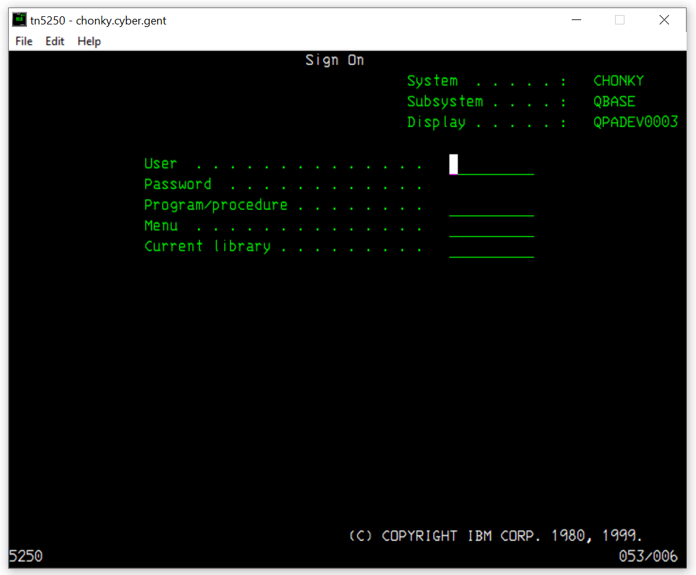

# tn5250

This is a fork of the [abandoned TN5250](https://sourceforge.net/projects/tn5250/) client on SourceForge made by Scott Klement.

## Building
### Unix/Linux

You need to have ncurses installed, and it is recommended to build outside the source directory.

### Win32/64

You need to have mingw64 installed. Then you can build using

    cmake -DCMAKE_TOOLCHAIN_FILE=cmake/mingw64-amd64.toolchain

## Usage

    ./tn5250 chonky.cyber.gent
